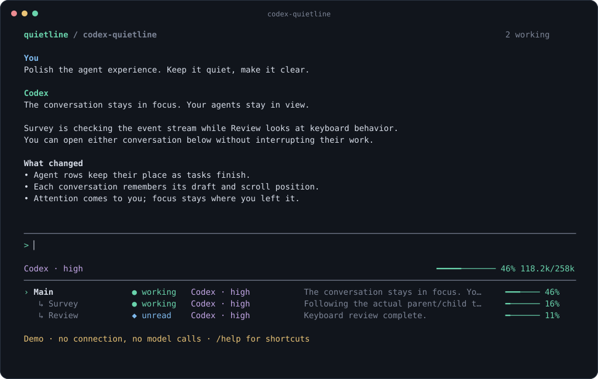
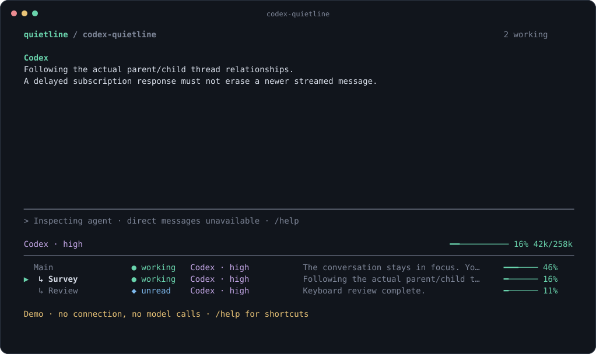
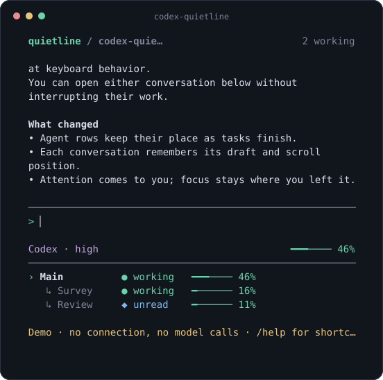

# codex-quietline

**Room to think. Everything in view.**

A quiet, agent-aware terminal for Codex. Keep your conversation in focus while
real subagents stay visible underneath it. Switch conversations, catch requests
for your attention, and see context pressure without opening another dashboard.

[](https://github.com/BerkayCaglar/codex-quietline/actions/workflows/ci.yml)
[](LICENSE)
[](https://nodejs.org/)



## Why

- **Your agents stay in view.** A persistent strip follows Codex's actual parent
  and child threads, including nested agents. No separate terminal required.
- **Navigation keeps your place.** Each conversation retains its draft and
  scroll position. Switching views never restarts an agent.
- **Attention has a destination.** Unread results and pending approvals stand out;
  jump to the next one with a single key. Requests identify their originating agent.
- **Quiet until it matters.** Context meters are always available. Low cache reuse
  and heavily used rate-limit windows appear when worth noticing.
- **Codex remains the engine.** Your account, models, tools, configuration and saved
  conversations are handled by the official Codex executable.

Inspired by [claude-quietline](https://github.com/BerkayCaglar/claude-quietline),
by the same author. This is an independent terminal client, not a Codex plugin
or a patch to your installed CLI.

## Install

Requires **Node.js 22+** and **Codex CLI 0.157.1 or newer** on `PATH`.
The compatibility baseline is 0.157.1. CI exercises protocol fixtures;
compatibility with future Codex releases must be checked explicitly.

Install the release package from [GitHub Releases](https://github.com/BerkayCaglar/codex-quietline/releases):

```sh
npm install -g https://github.com/BerkayCaglar/codex-quietline/releases/download/v0.1.0/codex-quietline-0.1.0.tgz
codex login
codex-quietline --doctor
codex-quietline
```

Or build from source:

```sh
git clone https://github.com/BerkayCaglar/codex-quietline.git
cd codex-quietline
npm ci
npm run build
npm link
codex-quietline --demo
```

`--demo` previews the interface without authentication, network access or model
calls. Windows, macOS and Linux use the same Node application; tmux is not required.

## Use

```sh
codex-quietline -C /path/to/project
codex-quietline "Review the changes and ask two subagents to check independent areas"
codex-quietline --read-only
codex-quietline --resume last
codex-quietline --resume THREAD_ID
```

Codex decides when to delegate according to your prompt and instructions. Quietline
does not create extra agents or spend tokens simply to populate its panel.

| Key                  | Action                                                  |
| -------------------- | ------------------------------------------------------- |
| `Tab`                | Switch between composer and agent strip                 |
| `↑` / `↓`, `j` / `k` | Select an agent while the strip is focused              |
| `Enter`              | Return to composer, send a prompt, or confirm a request |
| `Alt+↑` / `Alt+↓`    | Switch agents from the composer                         |
| `a`                  | Next request, error or unread result (strip focused)    |
| `Ctrl+R`             | Review pending requests; `Esc` defers without answering |
| `x`                  | Interrupt the selected active turn, with confirmation   |
| `PgUp` / `PgDn`      | Scroll conversation or request details                  |
| `End`                | Return to live output (strip focused)                   |
| `Alt+Enter`          | Insert a newline; pasted multiline text is preserved    |
| `Ctrl+C`             | Quit; asks first if work or requests are pending        |

Use `/help` for editing shortcuts and commands. `/models` and `/model ID` select
from your account's model catalog. `/effort LEVEL`, `/status`, `/compact`,
`/export PATH`, `/main`, `/attention`, `/stop` and `/quit` are also available.
Unknown slash commands are rejected rather than sent to the model.



## What control means

Viewing a thread is separate from sending input. Codex 0.157.1 deliberately
disables direct client messages to its V2 spawned subagents. Quietline respects
`canAcceptDirectInput`: you can inspect those conversations, answer their requests,
and interrupt an active turn, but cannot send them a new task directly.
Quietline never disguises a message to the parent model as direct child control.

While an input-capable conversation is running, sending a message uses Codex's
steering operation with the observed turn ID. It does not start a competing turn.
Approvals always require an explicit choice and default to a non-allowing option
when the server offers one. MCP forms and user questions are handled in the same
request view; secret answers are masked.

## Sessions and privacy

- One private `codex app-server` process, over stdin/stdout. No listening port.
- No telemetry, credential copying, cloud proxy or transcript uploads by Quietline.
  Codex itself still communicates with configured providers and tools.
- Codex owns conversation persistence. Quietline stores only the last root thread
  ID and working directory, under the OS user state directory.
- Quitting closes the private server and can interrupt running work. A saved
  conversation can be resumed; this is not a background-process survival guarantee.
- Lost connections do not automatically resend prompts or approvals. Quit and
  resume the printed thread ID to reconcile with Codex's saved conversation.
- Export is explicit and refuses to overwrite an existing file.

## Narrow terminals

The agent strip reduces columns before sacrificing status. More agents than fit
on screen remain reachable with the arrows. Minimum size: 40 columns × 16 rows.
Use `NO_COLOR=1` for plain text or `--ascii` for an ASCII context meter.



## Development

```sh
npm ci
npm run check
npm run dev -- --demo
npm run media
```

Tests use a real local fake-server process, replayed events and rendered terminal
components. They do not require an account or consume model tokens. For opt-in
checks against your installed Codex, see [validation](docs/validation.md).

[Architecture](docs/architecture.md) · [Contributing](CONTRIBUTING.md) ·
[Security](SECURITY.md) · [Changelog](CHANGELOG.md)

## License

[MIT](LICENSE) © Berkay Caglar. Unaffiliated with OpenAI. Codex is developed by OpenAI.
